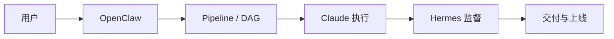

# OpenClaw、Hermes、Claude 三者定义与协作

本文说明在 Agent Hub 产品线中如何定义 **OpenClaw（入口）**、**Claude（执行）**、**Hermes（监督）**，以及三者如何协作更可维护、可验收。

**相关文档**：全链路愿景与网关位置见 [AI-LEGION-PIPELINE.md](./AI-LEGION-PIPELINE.md)；后端网关实现见 `backend/app/api/gateway.py`，代码执行见 `backend/app/services/executor_bridge.py`。

---

## 一、三者定义

### 1. OpenClaw — 统一入口与任务原点

**职责**：把外部的一句需求、一条 IM、一次 REST 调用，变成平台内可追溯的 **Pipeline 任务**：绑定来源用户、workspace/org、是否要 Plan/Act、何时开始编排。

**不做**：不负责在长对话里手写全部业务代码；不替代流水线里的阶段质量终审（那是 Hermes 职责域或等价闸门）。

**在仓库中的映射**：`/api/gateway/openclaw/*`（如 `openclaw/intake`，以及 Plan 模式的 `approve` / `reject` / `revise`）；产品侧语义为「多端统一接单网关」。

---

### 2. Claude — 实作之手（Coding 执行轨）

**职责**：在具体 **worktree / 沙箱目录** 内执行代码改动、调用本地工具链（按权限配置），产出可 diff、可构建、可测的工件，而不是仅在聊天窗口输出 Markdown。

**不做**：不单独定义「任务是否收口、能否上线」；最终放行应由监督轨或门禁规则决定。

**在仓库中的映射**：`executor_bridge.execute_claude_code`（Claude Code CLI 子进程）；与开发/CodeGen 阶段的衔接见 `pipeline_engine`、`codegen` 相关路径。

---

### 3. Hermes — 监督与门卫（独立第二视角）

**职责**：与「写代码的人」分离，基于 **PRD/契约、artifact、测试结果、策略与合规规则** 给出结构化结论，例如 **PASS / REQUEST_CHANGES / BLOCK**，必要时打回指定阶段，而不是替业务写实现。

**说明**：历史文档中曾出现「Hermes-Agent」命名，但仓库中未必存在独立服务名；**产品上将 Hermes 定义为一种职责即可**——可由强化后的 `review`、QA、Acceptance、self-verify、guardrails 等阶段共同承担，或未来单独接入只读 Supervisor 模型。

**与 Claude 的边界**：

| 角色   | 核心动作     | 主要依据       |
|--------|--------------|----------------|
| Claude | 改代码、跑命令 | 已批准任务与提示词 |
| Hermes | 审代码、判放行 | 契约、测试、规则  |

---

## 二、推荐协作流（谁在前谁在后）

```text
用户 / IM / API
      ↓
【OpenClaw】建任务 · 澄清 · Plan/Act（可选）
      ↓
编排引擎 / Lead（DAG 与阶段顺序）
      ↓
【Claude】在 worktree 实作 → 可验证 diff / 构建 / 测试日志
      ↓
【Hermes】对照契约与证据 → PASS / 驳回 / 降级
      ↓
artifacts / Share / Deploy
```



---

## 三、协作原则（工程上更优）

1. **单向依赖**  
   OpenClaw 只解决「任务从哪来、何时跑」；不要把业务规则堆在网关里。Claude 只消费已批准范围与明确路径。Hermes 只消费可验证证据（测试、artifact、门禁输出）。

2. **监督与执行分离**  
   避免同一模型既当唯一实现者又当最终裁判。开发之后、对外发布之前应有独立的「审」或「验收」环节（名称是否叫 Hermes 不重要）。

3. **契约先于动手**  
   Plan/Clarifier 把范围与验收句式写清；Claude 的指令应指向具体路径与完成判据；Hermes 按契约判据输出，减少主观「感觉可以上线」。

4. **命名与实现解耦**  
   代码里可以没有 `hermes` 字符串；但流水线上必须存在与 Hermes 等价的 **监督位**，否则容易退化为「能跑 demo、难以收口」。

---

## 四、与 Agent Hub 当前实现的对应关系

| 概念     | 典型落点 |
|----------|----------|
| OpenClaw | `gateway.py` OpenClaw 路由、任务创建、Plan 会话 |
| Claude   | `executor_bridge`、开发阶段 CodeGen |
| Hermes   | `review_stage_output`、QA/Acceptance、self-verify、guardrails、预算与人工闸门等（可逐步收敛为显式 Supervisor） |

---

## 五、一句话对外表述

**OpenClaw 接单，Claude 动手，Hermes（或质量体系）守门** — 与 `AGENTS.md` 中的「网关 → 编排 → 执行 → 验收」一致；三者职责清晰时，多渠道入口与长流水线才更容易统一验收与排障。
