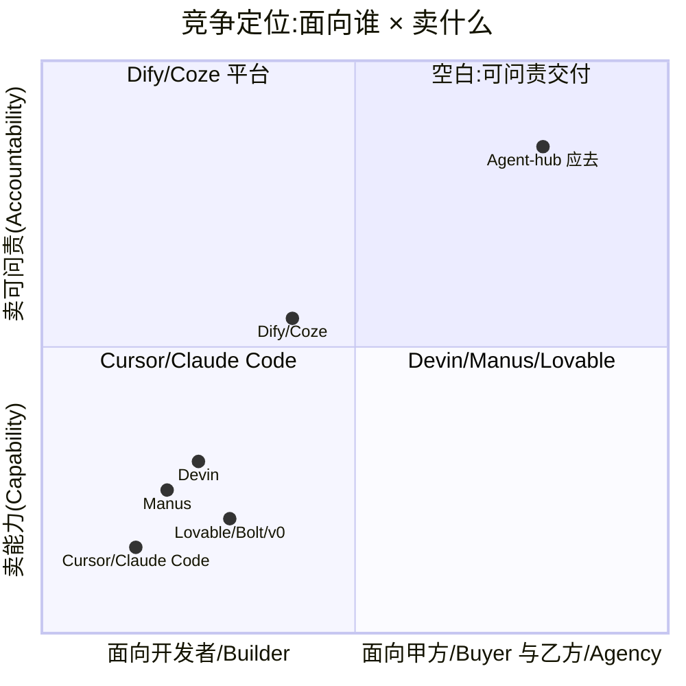
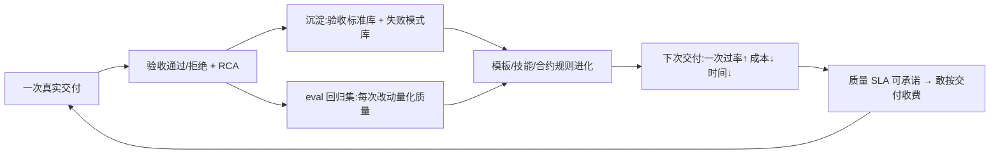

# Agent Hub 竞争战略 —— 怎么和市场抗衡(深透版)

> 起草日期:2026-06-10
> 状态:战略锚定,待团队对齐
> 关系:本文是**竞争与执行层**,承接 [`strategy-b-outcome-accountable-2026-05-25.md`](./strategy-b-outcome-accountable-2026-05-25.md)(商业层:结果合同/退款/永续维护),并以一次带文件行号的代码核查为依据(见 §2)。route-B 回答"卖什么、怎么收费";本文回答"为什么正面必死、在哪不对称能赢、砍什么、怎么排序、何时止损"。

---

## 〇、一句话总纲

> **不要和市场比"谁的 AI 更强"。做"让任何强 AI 的产出能被甲方验收、能在中国合规落地、能形成交付复利"的那一层。砍掉 90% 的广度,把"中后台/内部工具交付"一条流做到闭眼能信,用 eval 飞轮让它每天变好。这是巨头结构性进不来、而你已有一半地基的唯一战场。**

---

## 一、核心结论(TL;DR)

- **真实定位**:Agent Hub 不是"套壳 LLM",也不是"全自动交付平台",而是**以固定 SOP(14 角色)驱动的软件交付流水线 + 产物合约系统**。后端管线、产物版本化、QA 真实执行、部署闭环、分享验收是**真代码**;但"多智能体协作"很大程度是**编排出来的流水线**,而非自治协商。
- **正面打,每条战线必死**(§4):资本/基建/数据飞轮代差。任何"我要比 X 更 X"的命题都是自杀。
- **唯一出路是不对称**(§5–§6):占住巨头因商业模式/出身而**进不来**的象限——**面向甲方/乙方、卖"可问责交付"、本地化合规、品牌中立编排**。
- **唯一领先资产**:产物合约 + 版本化 + 验收闸门 + 失败 RCA + SSE 可解释泳道。把它做成护城河,而不是继续铺广度。
- **唯一护城河引擎**:eval 驱动的"度量→学习→改进"飞轮(§8)。**当前是断的**(learned_pattern 死代码、E2E 不验质量),必须接通。

---

## 二、真实能力剖面(实证,非口号)

> 依据:对 `agent_runtime / 协作 / 管线 / codegen / 前端 / 运维 / 安全` 的三路代码核查。

**真·生产级(应放大为护城河)**
- 多 provider LLM 路由,含工具/流式/回退/熔断(含 DeepSeek/Zhipu/Qwen 国产模型)——`backend/app/services/llm_router.py`
- DAG 编排:并行批次、重试、人工闸门、拒绝回环——`dag_orchestrator.py`
- ReAct 工具循环 + 角色沙箱 + MCP 动态工具——`agent_runtime.py`
- 产物系统:19 类型、版本链、合约校验(默认开启)——`artifact_writer.py` / `models/task_artifact.py` / `artifact_contract.py`
- Phase 6 QA 真跑 pnpm + Playwright;Phase 7 真 Vercel/本地预览——`qa_executor.py` / `deploy/`
- 失败 RCA 业务卡 + 分享验收 + 成本治理 + trace 双写

**"剧场"/未接线/兜底(预期落差来源)**
- `swarm_coordinator.py` 共识是**模拟投票的死代码**,全仓无运行时引用:
```261:272:backend/app/services/swarm_coordinator.py
        # Collect votes (in production, this would be async agent calls)
        for agent in self._agents.values():
            ...
            # Simulate voting based on trust and role
            if method == ConsensusMethod.WEIGHTED:
                vote = self._weighted_vote(agent, options)
```
- `lead_agent` 子任务是**纯 chat_completion、无工具**——"子 agent"不能真正动手
- 跨任务学习**未接线**:`store_learned_pattern` 无调用方、`learning_engine.py` 未接入完成回路
- codegen 兜底:`llm-local` 实质只定制 `Home.vue` 单文件;只有单 Vue 模板 golden
- 视觉证据:UI mockup 多数退化为 HTML 模板并标 `degraded_fallback`
- **质量门可绕**:`resume-pipeline` 仍默认 `force_continue=True`:
```1034:1041:backend/app/api/pipeline.py
            await execute_full_pipeline(
                ...
                force_continue=bool(params.get("force_continue", True)),
```
- E2E 明确"不验证交付质量"(`tests/e2e/hero-smoke.spec.ts`);hero run 实测 **83 分钟 + 人工干预**(`docs/ux-optimization-2026-06-08.md`)

---

## 三、根因:三个战略陷阱(病灶,不是症状)

上面所有问题不是独立 bug,是 3 个根因的投影。

### 陷阱 1 —— 用"组织架构隐喻"代替"难问题"
建模"14 角色的 AI 公司"对人类直觉友好,但**价值不在这里**。真正难且值钱的是**长程可靠执行**。"14 角色"把精力耗在编排固定 SOP,于是 swarm 只能模拟、协作变剧场。**组织隐喻是上一代叙事**(MetaGPT/ChatDev 路线热度已退;Devin 是单个会规划自纠错的 agent)。

### 陷阱 2 —— "演示完整度"优先于"一条流可靠"
5 入口、19 产物、Phase 4–7,广度惊人,但**没有一条流闭眼能信**。每加一个 feature 让演示更完整,却无一条路径达到可收费可靠度。**深度不足时,广度是负债。**

### 陷阱 3 —— 没有 eval = 没有复利 = 永远停在"随机能用"
**无法度量交付质量 → 无法改进 → 无法承诺 → 无法收费。** 没有 eval,与巨头差距**每天拉大**,因为他们有飞轮,你没有。

> 根因总纲:**你在建一个"看起来像 AI 公司"的系统,但没建"会变好"的系统。**

---

## 四、残酷现实:正面打,每条线必死

| 想打的战线 | 为什么必死 |
|---|---|
| 比 **Devin** 强的自治 codegen | 资本/基建/数据飞轮代差,且它已开放 MCP/API |
| 比 **Lovable/Bolt/v0** 好的建站 | 它们 TTFV 几十秒、对话式迭代、全栈一键部署;你 83 分钟 + 单 Vue 模板 |
| 比 **Manus** 广的通用 agent | 它有云 VM + computer-use,你 worktree 子进程 |
| 比 **Dify/Coze** 全的平台生态 | 它们规模化插件市场 + 多租户 SaaS + 流量,你技能注册表 6 个 |
| 比 **LangGraph/CrewAI** 好的多智能体框架 | 它们是社区标准 + LangSmith 可观测,你 swarm 是死代码 |

**结论:任何"做得比 X 更 X"的命题都是自杀。唯一出路是改变战场。**

---

## 五、不对称突破口:对手的结构性盲区

巨头的弱点是**因商业模式/出身而"不能或不愿"补的盲区**。



**右上象限是空的**:面向甲方/乙方、卖可问责交付。巨头优化的是"让会用的人更高效",不是"让付钱的甲方敢验收"。

四个结构性盲区(你都有一半地基):
1. **可问责性**:巨头是黑盒,产出代码/应用,不产出"可审计、可验收、有出处的交付物"。← 你已有合约+版本+验收+RCA+泳道。
2. **本地化/合规**:全球 SaaS,数据出域、不私有化、不接飞书/钉钉/企微、不路由国产模型、不碰信创。← 你 llm_router 已支持国产模型、gateway 已接飞书/QQ、docker 可私有化。
3. **乙方/外包业务闭环**:它们做"生成",不做"报价→方案→验收→结算→给甲方分享"这条生意流。← 你已有 90s 方案、分享页、accept/reject、成本治理。
4. **品牌中立编排**:它们每家都想自己当大脑,**永远不会**做"把别家最强模型/agent 当工具来治理"的层。← 你已有 MCP + DeerFlow delegate。

---

## 六、楔子:从"最强 Agent"转向"可问责交付层"

定位从 ❌"一个有 14 个 AI 角色的交付平台"(和谁都重叠,样样不如人)改写为:

✅ **"AI 交付治理层 / 可问责的乙方交付 OS"——大脑可插拔(Claude/GPT/DeepSeek/Devin via MCP),治理、验收、合规、结算闭环是你的。**

为什么能赢:
- **把弱点变不相关**:不需要自己有最强 codegen,而是**编排**外部最强 codegen,用合约/QA/验收**保证其输出可信**。脑子升级 = 你免费变强。
- **把强点变护城河**:合约/验收/RCA 是 builder 讨厌做、巨头不愿做的"问责基建"。
- **落在巨头进不来的象限**(右上 + 本地化 + 乙方流)。

> 类比:**别当 OpenAI,当"让 OpenAI 的输出能向甲方交代"的 SAP。**

---

## 七、楔子垂直:押注"中后台 / 内部工具 / 数据看板"

收敛到**一个窄垂直**,把它做到闭眼能信:

- **需求海量**(企业内部 IT / 外包最大单一品类)
- **UI 高度模板化**(套路固定 → 容易做到高一次过率)
- **验收标准清晰**(增删改查、权限、报表 → 可量化验收)
- **与现有 Vue 模板天然契合**

> 把这一类做到"闭眼能信",胜过 50 类做到"演示能看"。

---

## 八、护城河复利飞轮(当前断裂,必须接通)



三种复利资产(建立在已有结构上,巨头拿不到——因为它们没有"验收"动作):
1. **验收标准库**:甲方接受/拒绝 → 可复用 acceptance criteria
2. **失败模式库**:RCA 卡 → 结构化失败模式 → 反哺质量门与重规划
3. **垂直模板库**:每次成功交付 → 抽象成窄类高一次过率模板

---

## 九、逐对手打法:别碰 / 借力 / 在哪赢

| 对手 | 别碰(必输) | 借力(当工具) | 你赢的点 |
|---|---|---|---|
| **Devin** | 自治 codegen | MCP/API 当"开发脑" | 验收治理 + 私有化 + 国产化 + 乙方结算 |
| **Lovable/Bolt/v0** | 建站速度/体验 | 嵌它做前端原型 | 可审计交付物 + 甲方验收链接 + 数据不出域 |
| **Manus** | 通用 + computer-use | 复杂任务委派 | 企业问责 + 合规 + IM-native |
| **Dify/Coze** | 插件生态规模 | 兼容其工作流/插件 | "交付"而非"搭 bot";验收闭环 |
| **Cursor/Claude Code** | IDE 内编码 | 后台 agent 当执行器 | 面向甲方而非开发者 |

**统一打法:对所有"脑"保持中立可替换,只在"治理 + 验收 + 合规 + 业务闭环"上做深。**

---

## 十、必须砍掉什么(聚焦 = 减法,最难的一步)

- **砍 `swarm_coordinator` 及一切模拟多智能体**:死代码 + 制造虚假预期。要么做成真工具化子 agent + 共享黑板,要么删,对外口径改为"可靠 SOP 流水线"。
- **停止增加产物类型/入口/Phase**:深度不足时广度是负债。
- **放弃"通用 agent"幻想**:收敛到楔子垂直。
- **砍"什么都能生成"的 codegen 野心**:只保住中后台/内部工具一类做到高一次过率。

---

## 十一、三阶段路线图 + 可证伪目标

### H1(0–3 月)—— 证明"一条流可信"(不达标禁止扩张)
- 锁定楔子:中后台/内部工具交付;brain 用 Claude Code/DeepSeek。
- 建 **eval 回归集**(20–30 固定需求,LLM-judge + 硬门),每次改动出分。
- **质量门全入口收口**(`resume` 默认 `force_continue=False`);修真 QA 信号(注入 `window.__qa_errors`、独立 `pnpm build` 校验)。
- **量化目标**:楔子垂直**端到端一次过率 ≥ 70%**、**人工干预 = 0**、**TTFV < 15 分钟**。
  - ✅ 达标 → H2;❌ → 收窄需求重来,禁止加功能。

### H2(3–9 月)—— 把"可问责"做成护城河
- **接通飞轮**:learned_pattern/learning_engine 真接入完成回路;验收标准库 + 失败模式库上线。
- **brain-agnostic 编排**:MCP 标准化,Claude/Devin/各模型一键切换。
- **本地化/合规**:私有化一键化、国产模型默认路由、飞书/钉钉/企微 native intake、数据不出域开关。
- **乙方业务闭环**:对齐 route-B 的 outcome contract(报价→方案→验收→结算→甲方分享)。
- **量化目标**:一次过率 ≥ 85%;复利可见(同类第 N 个交付比第 1 个时间↓40%)。

### H3(9–18 月)—— 从工具变平台
- **交付模板市场**(垂直内被验收过的模板可复用/交易)。
- 把"可问责交付 OS"开放给乙方/外包公司做多租户。
- **量化目标**:按交付/SLA 收费跑通,"验收不通过不收费"敢承诺。

---

## 十二、假设验证 / 何时止损(诚实面)

- **核心假设**:存在一批"花钱买交付、需要可审计验收、且数据/合规敏感"的买方(乙方公司、企业内部 IT、政企)。→ H1 必须先找 **3–5 个真实付费**验证。
- **kill criteria 1**:楔子垂直 H1 内做不到 70% 一次过率 + 0 人工干预 → 治理层撑不起交付,回到更窄场景或转纯工具。
- **kill criteria 2**:Devin/Lovable 开始**本地化 + 接 IM + 做验收** → 窗口关闭,需更快或转售/被并。
- **最大风险**:团队/资本能否撑住"做深一条流"的耐心——广度好做、深度难熬,而过去惯性是广度。

---

## 十三、与既有文档的关系

| 文档 | 层次 | 回答的问题 |
|---|---|---|
| 本文 `competitive-strategy.md` | 竞争与执行层 | 为什么正面必死、在哪不对称能赢、砍什么、怎么排序、何时止损 |
| [`strategy-b-outcome-accountable-2026-05-25.md`](./strategy-b-outcome-accountable-2026-05-25.md) | 商业层 | 卖什么(结果合同)、怎么收费(per outcome + 维护订阅)、退款承诺 |
| [`github-vs-agent-hub.md`](./github-vs-agent-hub.md) | 能力剖面 | 实现层已有什么(避免把纸面愿景当缺口) |

> 两份战略文档同源(都押注"对结果负责的交付方")。本文补上**为什么这是唯一能赢的战场,以及怎么不被广度拖死**。
