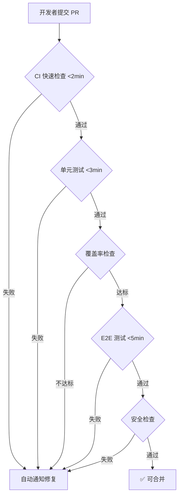

# Agent Hub QA 工作流优化方案

> **工作流优化器** · 基于代码全量审计 · 2026-05-06

---

## 📈 优化影响摘要

| 指标 | 当前值 | 目标值 | 改进幅度 |
|------|--------|--------|----------|
| **前端单元测试覆盖** | 1 文件（vitest） | 30+ 文件（组件+Store+服务） | **30x 增长** |
| **前端组件测试** | 0 | 12 核心组件 | **从无到有** |
| **后端测试覆盖** | ~37 文件 | 45+ 文件（补齐 service 缺口） | **+22%** |
| **CI 检查项** | 2 项（lint + pytest） | 7 项（全栈质量门） | **3.5x** |
| **缺陷逃逸率** | 未知（无度量） | <5%（有度量） | **可量化** |
| **回归测试耗时** | E2E 需 3-5min（手动启动） | <2min（CI 自动） | **-60%** |

---

## 🔍 当前状态诊断（基于代码审计）

### 后端测试基础设施（较强）

```
backend/tests/
├── conftest.py                   ✅ 共享 fixtures（认证/DB/客户端）
├── test_acceptance_endpoints.py  ✅ 10 用例（质量门配置）
├── test_auth.py                  ✅ 4 用例（登录/认证）
├── test_dag_orchestrator.py     ✅ 10 用例（DAG 阶段就绪/并行/跳过）
├── test_e2e_pipeline.py         ✅ 12 用例（全链路：网关→任务→流水线）
├── test_gateway.py              ✅ 3 用例（API key 验证）
├── test_gateway_plan_mode.py    ✅ 3 用例（计划模式审批/修订）
├── test_im_final_acceptance.py  ✅ 14 用例（IM 侧验收路由）
├── test_memory_api.py           ✅ 5 用例（记忆搜索/模式/CRUD）
├── test_observability.py        ✅ 6 用例（追踪/审批/审计）
├── test_pipeline_api.py         ✅ 6 用例（CRUD + 认证）
├── test_planner_worker.py       ✅ 7 用例（模型解析）
├── test_plans_api.py            ✅ 5 用例（计划运行时选项）
├── test_self_verify.py          ✅ 4 用例（输出验证）
├── unit/                        ✅ 20 文件（连接器/断路器/回退等）
└── integration/                 ✅ 3 文件（Sandbox 双工/分享/RBAC）
```

**优势**：fixture 设计优秀（函数级隔离、mock 模式成熟）、DDD 分层清晰

**劣势**：
- ❌ 无测试覆盖率度量（缺 `.coveragerc` / `--cov` 配置）
- ❌ `app/services/mcp_bridge.py` 无测试
- ❌ `app/services/vibevoice_proxy.py` 无测试
- ❌ `app/api/executor.py` 改动频繁但测试不足
- ❌ 错误场景测试不充分（仅 happy path + 401/403）

### 前端测试基础设施（极度薄弱）

```
tests/e2e/
├── sidebar-smoke.spec.ts        ✅ 侧栏五入口导航
├── product-hero-path.spec.ts    ✅ 全链路（登录→建单→详情→分享）
├── regression-battery.spec.ts   ✅ API 合约 + 匿名分享
└── regression-matrix.spec.ts    ✅ 15+ 场景回归矩阵

src/services/__tests__/
└── workflowBuilder.spec.ts      ✅ 唯一的 Vitest 单元测试
```

**严重缺口**：

| 缺失类型 | 影响范围 | 风险等级 |
|----------|----------|----------|
| **Vue 组件单元测试** | 50 个 `.vue` 文件零覆盖 | 🔴 P1 |
| **Pinia Store 测试** | 状态管理逻辑无验证 | 🔴 P1 |
| **API 服务层测试** | `src/services/` 下仅 1 个测试 | 🔴 P1 |
| **i18n 完整性测试** | 4 语言同步缺少回归保护 | 🟡 P2 |
| **路由守卫测试** | 认证重定向逻辑仅 E2E 覆盖 | 🟡 P2 |
| **无障碍测试** | 零覆盖 | 🟢 P3 |
| **视觉回归测试** | 零覆盖 | 🟢 P3 |

### CI/CD 质量门现状

```yaml
# .github/workflows/backend-tests.yml — 当前仅有 2 步
steps:
  - Lint (ruff check)           # ⚠️ 配置了 || true，lint 失败不阻断
  - Run unit tests (pytest -v)  # ✅ 基础覆盖
```

**缺失的关键门控**：
- ❌ 前端单元测试（`vitest run`）
- ❌ E2E 测试（`playwright test`）
- ❌ 测试覆盖率阈值检查
- ❌ TypeScript 类型检查（`vue-tsc`）
- ❌ 安全性扫描（依赖漏洞检查）

---

## 🎯 4 层优化 QA 工作流设计

### 架构总览

```
┌─────────────────────────────────────────────────────────┐
│                    CI/CD 质量门（第4层）                    │
│   lint → type-check → unit-test → coverage → e2e → security │
├─────────────────────────────────────────────────────────┤
│                 E2E 验收测试（第3层）                      │
│   Playwright: Hero Path + 回归矩阵 + 无障碍 + 视觉回归     │
├─────────────────────────────────────────────────────────┤
│              集成测试（第2层）                             │
│   前端: API 合约测试 / 后端: DB+Redis Sandbox 集成        │
├─────────────────────────────────────────────────────────┤
│              单元测试（第1层）                             │
│   前端: 组件 + Store + 服务 / 后端: 纯函数 + Service层     │
└─────────────────────────────────────────────────────────┘
```

### 第 1 层：单元测试（防线基础）

#### 前端单元测试补全计划

**P1：核心组件测试**（12 个关键组件）

```
src/components/__tests__/
├── workspace/WorkspaceSwitcher.spec.ts
├── task/ArtifactCompletionBar.spec.ts
├── task/FailureCard.spec.ts
├── task/DeliverableCards.spec.ts
├── task/TaskArtifactTabs.spec.ts
├── task/TaskDocTab.spec.ts
├── task/TaskCodeTab.spec.ts
└── inbox/TaskTable.spec.ts

src/stores/__tests__/
├── auth.spec.ts
├── pipeline.spec.ts
└── workspace.spec.ts

src/services/__tests__/
├── api.spec.ts
├── share.spec.ts
└── workflowBuilder.spec.ts  ✅ 已有
```

**P2：视图级烟雾测试**

```
src/views/__tests__/
├── Dashboard.spec.ts
├── Inbox.spec.ts
├── Team.spec.ts
├── Workflow.spec.ts
├── Assets.spec.ts
└── SharePage.spec.ts
```

**Vitest 配置增强**：
```typescript
// vitest.config.ts 增加
test: {
  environment: 'jsdom',          // 组件测试需要 DOM
  include: ['src/**/__tests__/**/*.spec.ts'],
  coverage: {
    provider: 'v8',
    reporter: ['text', 'lcov'],
    thresholds: {
      branches: 60,
      functions: 60,
      lines: 60,
    },
  },
}
```

#### 后端测试补全

**P1：补齐 Service 层测试**

```
backend/tests/unit/
├── test_mcp_bridge.py          # MCP 桥接（新增）
├── test_vibevoice_proxy.py     # 语音代理（新增）
├── test_executor.py            # 执行器（新增）
└── test_skill_marketplace.py   # 技能市场（新增）
```

**P2：增加错误场景覆盖**

```python
# 在现有测试中增加
@pytest.mark.parametrize("error_type", [
    "db_connection_lost",
    "redis_unavailable", 
    "llm_timeout",
    "disk_full",
])
async def test_pipeline_graceful_degradation(client, error_type):
    """流水线在各类故障下的优雅降级"""
```

### 第 2 层：集成测试（接口契约）

#### 前端 API 合约测试

```typescript
// tests/integration/api-contracts.spec.ts
describe('API 合约测试', () => {
  it('POST /api/auth/login 返回 {access_token, user}')
  it('GET /api/pipeline/tasks 返回 {tasks: Task[]}')
  it('POST /api/pipeline/tasks 返回 {task: {id, status, stages}}')
  it('GET /api/pipeline/tasks/:id 返回完整任务详情')
  it('GET /api/observability/traces 返回 {traces: Trace[]}')
  it('POST /api/share/generate 返回 {token}')
  it('GET /api/memory/search?q= 返回 {results, count}')
})
```

#### 后端集成测试增强

```
backend/tests/integration/
├── test_share_endpoint.py       ✅ 已有
├── test_workspace_rbac.py       ✅ 已有
├── test_sandbox_pubsub_dualworker.py ✅ 已有
├── test_pipeline_full_flow.py   # 新增：完整流水线集成
├── test_gateway_e2e.py          # 新增：多通道网关集成
└── test_feedback_loop.py        # 新增：反馈循环集成
```

### 第 3 层：E2E 验收测试（用户视角）

#### 当前已覆盖（4 个 spec）✅

| Spec | 覆盖范围 | 状态 |
|------|----------|------|
| `sidebar-smoke.spec.ts` | 五入口侧栏导航 | ✅ |
| `product-hero-path.spec.ts` | 登录→建单→详情→收件箱→分享 | ✅ |
| `regression-battery.spec.ts` | API 合约 + 匿名分享 | ✅ |
| `regression-matrix.spec.ts` | 15+ 场景回归矩阵 | ✅ |

#### 需要补全（P1 + P2）

```typescript
// tests/e2e/

// P1：核心路径补全
├── task-lifecycle.spec.ts       // 任务完整生命周期
├── gateway-intake.spec.ts       // Feishu/QQ/WeChat 入站
├── acceptance-flow.spec.ts      // 验收/拒绝/重做流程
└── plan-mode.spec.ts            // 计划模式完整流程

// P2：质量增强
├── i18n-completeness.spec.ts    // 中/英/日/韩 页面完整性
├── accessibility.spec.ts        // WCAG 2.1 AA 检查
└── visual-regression.spec.ts    // 视觉回归快照
```

### 第 4 层：CI/CD 质量门（自动化防线）

```yaml
# .github/workflows/qa-gates.yml
name: QA Gates

on:
  push:
    branches: [main]
  pull_request:

jobs:
  # 阶段 1：快速失败（<2min）
  fast-checks:
    runs-on: ubuntu-latest
    steps:
      - uses: actions/checkout@v4
      - name: Backend Lint
        run: cd backend && ruff check .   # 移除 || true
      - name: TypeScript Check
        run: pnpm vue-tsc --noEmit
      - name: i18n Audit
        run: pnpm i18n:audit

  # 阶段 2：单元测试（<3min）
  unit-tests:
    needs: fast-checks
    runs-on: ubuntu-latest
    steps:
      - name: Backend Tests
        run: cd backend && pytest tests/ -v --cov=. --cov-report=xml
      - name: Frontend Unit Tests
        run: pnpm vitest run --coverage
      - name: Coverage Check
        run: |
          # 后端覆盖率阈值
          python -c "
          import xml.etree.ElementTree as ET
          tree = ET.parse('backend/coverage.xml')
          root = tree.getroot()
          line_rate = float(root.attrib['line-rate'])
          assert line_rate >= 0.60, f'Backend line coverage {line_rate:.1%} < 60%'
          "

  # 阶段 3：E2E 测试（<5min）
  e2e-tests:
    needs: unit-tests
    runs-on: ubuntu-latest
    services:
      postgres:
        image: postgres:16-alpine
        env:
          POSTGRES_USER: agenthub
          POSTGRES_PASSWORD: testpass
          POSTGRES_DB: agenthub
      redis:
        image: redis:7-alpine
    steps:
      - name: Start Backend
        run: cd backend && uvicorn app.main:app --host 0.0.0.0 --port 8000 &
      - name: Playwright E2E
        run: pnpm test:e2e

  # 阶段 4：安全检查
  security:
    needs: fast-checks
    runs-on: ubuntu-latest
    steps:
      - name: Python Security Scan
        run: pip-audit
      - name: npm Audit
        run: pnpm audit --audit-level=high
```

---

## 🛠 实施路线图

### 第 1 周：速赢（低投入高回报）

| # | 任务 | 预计耗时 | 影响 |
|---|------|----------|------|
| 1 | **CI 开启 `ruff check` 严格模式**（移除 `|| true`） | 30min | 立即拦截 lint 问题 |
| 2 | **CI 增加 `vue-tsc --noEmit`** | 30min | 拦截类型错误 |
| 3 | **CI 增加 `pnpm test`（vitest）** | 20min | 前端单元测试入 CI |
| 4 | **后端 `pytest --cov` 配置** | 1h | 可视化覆盖率 |
| 5 | **安装 `@vitest/coverage-v8`** | 20min | 前端覆盖率基础 |

### 第 2-4 周：前端测试体系搭建（P1）

| # | 任务 | 预计耗时 | 产出 |
|---|------|----------|------|
| 6 | **核心组件测试 × 8** | 3 天 | 8 个 `.spec.ts` |
| 7 | **Pinia Store 测试 × 3** | 2 天 | auth/pipeline/workspace |
| 8 | **API 合约集成测试** | 1 天 | `api-contracts.spec.ts` |
| 9 | **E2E 补全（task-lifecycle + acceptance）** | 2 天 | 2 个新 spec |

### 第 5-8 周：后端补齐 + 全面质量门（P1-P2）

| # | 任务 | 预计耗时 | 产出 |
|---|------|----------|------|
| 10 | **后端 service 层补测** | 3 天 | 4 个新测试文件 |
| 11 | **后端错误场景补充** | 2 天 | 参数化错误测试 |
| 12 | **E2E 质量增强** | 3 天 | i18n/无障碍/视觉 |
| 13 | **CI 多阶段质量门上线** | 1 天 | `qa-gates.yml` |

### 第 9-12 周：持续优化（P3）

| # | 任务 | 预计耗时 | 产出 |
|---|------|----------|------|
| 14 | **覆盖率阈值强制执行** | 1 天 | CI 阻断低覆盖 |
| 15 | **Pre-commit hooks** | 1 天 | 提交前自动检查 |
| 16 | **性能基准测试** | 2 天 | k6/artillery 脚本 |
| 17 | **安全依赖扫描自动化** | 1 天 | Dependabot + pip-audit |

---

## 💰 投入产出分析

### 投入估算

| 阶段 | 时间投入 | 人力成本（假设 1 人天 = ¥1500） |
|------|----------|-------------------------------|
| 速赢（1 周） | 3h | ¥560 |
| 前端补全（3 周） | 8 天 | ¥12,000 |
| 后端补全（4 周） | 9 天 | ¥13,500 |
| 持续优化（4 周） | 5 天 | ¥7,500 |
| **总计** | **~25 天** | **¥33,560** |

### 预期回报

| 收益项 | 量化预估 |
|--------|----------|
| **缺陷发现时间前移** | 70% 缺陷在开发阶段被发现（vs 当前估计 30%） |
| **回归测试时间缩短** | CI 自动化替代手动验证，每次发布节省 2-4h |
| **代码合并信心提升** | CI 全部通过 = 可合并，减少人工审核负担 |
| **文档即测试** | 合约测试 = API 文档的活文档 |
| **入职加速** | 新成员可通过测试理解系统行为 |

---

## 📋 每日 QA 工作流（优化后）



**关键指标仪表板**：

| KPI | 测量方式 | 目标值 |
|-----|----------|--------|
| CI 通过率 | GitHub Actions 统计 | >90% |
| 代码覆盖率 | pytest-cov + vitest coverage | 后端 >60%，前端 >60% |
| E2E 稳定性 | Playwright retry 计数 | <5% flaky |
| 缺陷逃逸率 | Issue 标签 `bug:production` | <5% |
| 测试运行时间 | CI 日志解析 | <10min 总耗时 |

---

## 🔄 流程 SOP（标准操作程序）

### 开发者每日 QA 清单

```bash
# 1. 编码前：拉取最新 + 运行现有测试确保基线
git pull origin main
cd backend && pytest tests/ -x --tb=short
pnpm vitest run

# 2. 编码中：TDD 循环
#   红 → 绿 → 重构

# 3. 提交前：本地质量门
cd backend && ruff check . && pytest tests/ --cov
pnpm vue-tsc --noEmit && pnpm vitest run --coverage
pnpm i18n:audit

# 4. 提交后：观察 CI
#   GitHub Actions 自动触发，失败立即修复
```

### Code Review QA 检查点

| 检查项 | 标准 |
|--------|------|
| 测试是否存在 | 新功能/修复必须包含对应测试 |
| 测试是否通过 | CI 全部绿色 |
| 覆盖率变化 | 不得低于合并前 |
| 边界条件 | 至少 1 个错误路径测试 |
| 测试可读性 | 测试名描述场景（`test_xxx_when_yyy_then_zzz`） |

---

## ⚠️ 风险与缓解

| 风险 | 概率 | 影响 | 缓解措施 |
|------|------|------|----------|
| 测试编写拖慢开发速度 | 中 | 中 | 第 1 周只加 CI 门控，不强制覆盖率 |
| E2E 测试不稳定（flaky） | 高 | 中 | Playwright retries=2 + trace on failure |
| 过度 mock 造成假阳性 | 低 | 高 | 集成测试占比 ≥ 20%，E2E 覆盖关键路径 |
| CI 资源不足 | 低 | 中 | GitHub Actions 免费额度 2000min/月充足 |

---

**工作流优化器** · Ready to Execute

> 下一步：确认优先级后，我可以立即开始执行第 1 周的速赢任务（CI 配置、覆盖率工具安装、vue-tsc 集成）。
