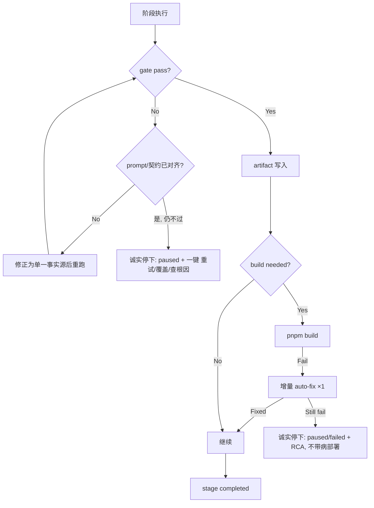

# Agent Hub UX 优化分析报告

> 日期：2026-06-08 · 版本：v1.1
> 范围：速度、SSE 实时流、Pipeline 自愈、市场对标
>
> **v1.1 修订**：修正 4 处技术硬伤（①不取消非流式 fallback，改为两路都发事件 ②区分"反馈延迟 vs 总时长"、合成 chunk≠真流式 ③gate 不过禁止"降级重跑"死循环，改为单一事实源对齐 ④build 失败禁止"标 degraded 继续部署"，改为诚实停下）；重排优先级（自愈/诚实态与 SSE 并列 P0）；标注前端 A 已完成项；补成功指标与 n=1 样本说明。

---

## 1. 背景

2026-06-08 对 Hero 闭环（待办看板 v4）进行完整验收，7 阶段 pipeline 最终通过（task=done），但暴露三个严重问题：

| 问题 | 严重度 | 现象 |
|------|--------|------|
| **速度** | P0 | 简单 demo 耗时 **83 分钟**（planning→deployment） |
| **静态页面** | P0 | 用户操作后页面完全无变化，数分钟才跳到一个结果 |
| **手动介入** | P1 | 全程 3 次人工干预（gate bypass、锁清理、force run） |

---

## 2. 速度分解

### 2.1 时间线（task `98a0116d`）

| 阶段 | 状态 | 耗时 | 说明 |
|------|------|------|------|
| planning | done | 5.5 min | LLM 正常产出，gate score 0.589 |
| → **等待** | — | **+25 min** | gate fail → 人工 bypass |
| design | done | 3 min | LLM 写入 |
| architecture | done | 14.8 min | LLM + Mermaid 图表生成 |
| development | done | 20 min | CodeGen + pnpm build（含 auto-fix 重试） |
| testing | done | 29.9 min | LLM 7 min + build failed auto-fix 22 min |
| reviewing | done | 4 min | LLM 评审 |
| deployment | done | 7.2 min | pnpm preview + Playwright screenshot |
| **总计** | **done** | **83 min** | 仅 ~70 min 有效执行，~13 min 浪费在等待/重试 |

### 2.2 速度杀手

| # | 问题 | 根因 | 贡献时间 |
|---|------|------|---------|
| 1 | **auto-fix 重试** | testing 阶段 pnpm build 失败，2 次 auto-fix 各花 10+ min | ~22 min |
| 2 | **quality gate 卡住** | planning gate score 0.589 < 0.7，需要人工 bypass | ~25 min sleep |
| 3 | **scheduler 丢任务** | deployment 提交后锁残留，scheduler 空但 stage 卡 active | ~8 min sleep |
| 4 | **LLM 非流式** | 全量等待 LLM 输出完成，用户无反馈感知 | 每阶段额外感知 |
| 5 | **疑似重复构建（待查）** | development 已 `pnpm build`（20min），testing 又 build（29.9min 含 22min auto-fix）。需查 testing 是否从零重建而非复用 development 产物（呼应诊断 #9 `source_manifest` 缺失）——若是，省下来可能比砍 auto-fix 次数更狠 | 潜在 ~20 min |

---

## 3. SSE 实时流分析

### 3.1 现状架构

```
Redis Pub/Sub (agenthub:pipeline:events)
    ↕
  emit_event()       ← pipeline_engine.py SSE 发布端
    ↕
  EventSource         ← 前端订阅（7+ 个独立连接）
    ↕
  useGlobalSSE        ← singleton 单例（被 SystemHealthBar + useLiveTasks 使用）
  pipeline Store      ← Pinia store 独立连接（被 Dashboard 使用）
  PipelineTaskDetail  ← 详情页独立连接
  Team/Workflow/Dag   ← 各自独立连接
```

### 3.2 核心问题

**问题 A：`_stream_stage_output` streaming 不可靠**

`pipeline_engine.py:1534-1548` — 当 streaming 遇到任何错误（网络抖动、模型接口超时等），会静默 fallback 到 `chat_completion_with_fallback`（非流式），且**不会发出 `stage:output-chunk` 事件**。

```python
# _stream_stage_output 的 fallback 逻辑
try:
    stream = chat_completion_stream(...)  # 可能失败
    for sse_line in stream:
        # emit stage:output-chunk
except Exception:
    # ⚠️ 静默 fallback → 不发 chunk 事件
    return await llm_fb(model, messages, ...)
```

**问题 B：7+ 独立的 EventSource 连接**

| 连接所有者 | 生命周期 | 说明 |
|-----------|---------|------|
| `useGlobalSSE` | 常驻 | singleton，仅 2 个消费者使用 |
| `pipelineStore` | 常驻 | Pinia store，Dashboard 使用 |
| `PipelineTaskDetail` | 每页 | 详情页，事件处理最完整 |
| `Team.vue` | 每页 | 团队页 |
| `Workflow.vue` | 每页 | 工作流页 |
| `PipelineDagCanvas` | 每组件 | DAG 节点状态 |
| `WorkflowBuilder` | 每页 | 构建器页 |

每个连接都调用 `new EventSource(url)` → 后端生成同等数量的 Redis 订阅者 → 浪费。

**问题 C：`StageLiveOutput.vue` 无事件=无内容**

StageLiveOutput 组件依赖 `stage:output-start` / `stage:output-chunk` / `stage:output-end` 事件来渲染实时输出。但当 streaming fallback 后，这些事件不产生，组件永远 `visible=false`。

### 3.3 用户感知差距

| 场景 | 现状 | 行业标准 |
|------|------|---------|
| 点击"执行" | 页面不变，"正在处理"标签 | 3 秒内显示第一个 token |
| 阶段运行中 | 页面文字固定，无动态内容 | token 逐字流式更新 |
| 阶段完成 | 突然跳转到结果 | 静默过渡"在看的部分变完整" |
| 失败 | 任务变 failed，需刷新 | 错误行标记 + 可选重试 |

---

## 4. 手动介入分析

### 4.1 本次 hero 闭环的人工操作

| 时间 | 介入原因 | 操作 |
|------|---------|------|
| 07:05 | planning gate score 0.589 < 0.7 | `gate-override` bypass |
| 07:41 | development 卡在 active → task failed | force update DB status |
| 08:14 | deployment scheduler 丢失 | 清理 Redis 锁 + 重新 run-stage |
| 16:11 | testing 卡在 active → task failed | force update DB → 重新 run-stage |

### 4.2 自愈短板

| 场景 | 应自动做的事 | 当前行为 |
|------|-------------|---------|
| gate score 低于 threshold | 对齐 prompt/契约（单一事实源）；仍不过则**诚实停下+一键操作** | 卡住等人工（且降级重跑会死循环，见 §6 #6） |
| build 失败 | 分析错误 → 增量修复 | 全量重跑 LLM（慢） |
| Redis 锁残留 | 5 分钟超时自动释放 | 永远卡住 |
| 异常捕获（coroutine not callable） | 记录错误 + 标记 stage failed | task 变 failed，stage 仍 active |
| reload/崩溃后孤儿任务（stage 永久 active） | 启动对账：超期 active→error、task→paused | ✅ `orphan_reconciliation.py` + `_scan_orphan_tasks` 启动对账 |

---

## 5. 市场对标

| 维度 | Cursor | Claude Code | GitHub Copilot | Vercel AI SDK | **Agent Hub** |
|------|--------|-------------|----------------|---------------|---------------|
| **流式 UI** | ✅ diff 流式展示 | ✅ token 级流式 + Artifact | ✅ 行级内联建议 | ✅ 标准 SSE 协议 | ❌ 全批处理 |
| **首 token 时间** | <500ms | <1s | <200ms | 取决于模型 | **3-30min** |
| **错误恢复** | 重试最后一帧 | 自动降级模型 | 静默回退 | 按需配置 | 卡住等人工 |
| **连接管理** | 单连接 | 单连接 | 单连接 | 按页创建 | 7+ 连接乱建 |
| **用户反馈** | 即时编码反馈 | Artifact 实例化 | 行级 inline | 标准流式 | 静态页面 |
| **自愈能力** | 自动 lint 修复 | 自动修正 | 不中断 | 无内置 | gate bypass 需人工 |

---

## 6. 改进计划

> **优先级修正（v1.1）**：原版把 "SSE streaming" 列为唯一 P0，但用户体验最差的三件事——卡 8h 僵尸任务、25min 等门禁、手动改 DB 救活——**都是"自愈/诚实状态"问题，不是 streaming**。streaming 让"正在跑的那一刻"变活，但**一个卡死的任务，加了 streaming 还是死的**。因此 P0 应是**两条并行**：①SSE 实时流（运行中变活）②孤儿任务/锁自愈 + 诚实卡住态（卡住时说人话）。前端 A + 后端启动对账均已落地。
>
> **成功指标（先定义再优化）**：首个可见反馈 < 2s · 简单 demo 总时长 < 20min · 人工介入次数 = 0 · 截获的 SSE 流含 `output-chunk`。
>
> **样本说明**：§2 的 83min / 22min 等数字来自单个 task `98a0116d`（n=1），auto-fix 时长方差极大；下结论前建议用可复跑的 SSE 探针（把 `/tmp/hero_sse_v4.txt` 脚本化）多跑几次取中位数。

### P0 — SSE 实时流 + 自愈/诚实态（本周，两条并行）

| # | 改项 | 文件 | 说明 |
|---|------|------|------|
| 1 | **保留**非流式 fallback，但让它也发 chunk（**已落地 B2**） | `sse.py` + `pipeline_engine.py` + `stage_layers.py` | ⚠️ 不要取消 fallback。streaming 失败/产出为空时仍走 `llm_fb`，通过 `emit_synthetic_output_stream()` 补发 `output-start` + 合成 `output-chunk` ×N + `output-end`；并修复批处理 flush 漏发 chunk 的 bug |
| 2 | 前端监听 `stage:heartbeat`（**已落地 B1**） | `PipelineTaskDetail.vue` | 状态卡显示"已工作 Xs · 第 N/总 步"的秒级跳动计时 |
| 3 | `StageLiveOutput` 改为持续可见（**已落地 B2**） | `StageLiveOutput.vue` + `PipelineTaskDetail.vue` | `stage:processing`/`heartbeat` 即显示骨架屏；`output-chunk` 到达后切换为逐字流式面板 |

### P0 — 产物增量显形（**已落地 B3**）

| # | 改项 | 文件 | 说明 |
|---|------|------|------|
| 4 | 写入 DB 时发 `artifact:written` SSE | `artifact_writer.py` | 每次 `_write_one_artifact` 成功后推送类型/版本/长度，前端无需等整阶段结束才刷新 |
| 5 | 流式 chunk → 交付物 Tab 实时草稿 | `PipelineTaskDetail.vue` + `TaskDocTab.vue` | `output-chunk` 按 stage→artifact 映射累积草稿；完成条显示紫色「生成中」脉冲 |
| 6 | 视觉类工件自动刷新 | `TaskArtifactTabs.vue` + mockup/arch/QA/deploy 子 Tab | `refreshNonce` + 12s 轮询兜底；UI 图/架构图/预览 URL 写入后自动出现 |

### P1 — 速度优化（本月）

| # | 改项 | 文件 | 说明 |
|---|------|------|------|
| 5 | auto-fix 仅 1 次 + 包级修复 | `pipeline_engine.py:2210` | 不重新调用完整 LLM，截取 build.log 错误增量修复 |
| 6 | gate fail 时对齐"单一事实源"而非降级 | `artifact_contract.py` / `stage_constants.py` / `learning_loop.py` | ⚠️ 不要"降级到更便宜模型重跑"——更弱的模型只会分更低且**死循环**。planning 系统性不达标的真因是 prompt≠契约≠learning 覆盖三方打架（见 `e2e-quality-honesty-diagnosis.md` #12/#13），应让契约/prompt/reviewer 用**同一份章节清单**。门禁分仍不够时给"诚实停下 + 一键重试/覆盖"，不静默自爆也不假装通过 |
| 7 | scheduler 锁 5 分钟 TTL | `task_scheduler.py` | `redis.setex(lock, 300, ...)` 防永久卡死 |
| 8 | 并行非依赖阶段 | `dag_orchestrator.py` | planning→design→architecture 可并行 |

### P2 — 用户感知（长期）

| # | 改项 | 说明 |
|---|------|------|
| 9 | Token 预算 + 剩余时间预估 | 在 Dashboard 卡片和详情页头部展示。**前置**：`spent_usd` 当前恒为 $0（诊断 #4），须先把 token 记账接进 `execute_full_pipeline` |
| 10 | ~~失败"建议操作"按钮~~（**A 已完成**） | 已落地：状态卡待审批→批准/驳回，疑似中断→继续执行，门禁不过→查根因/覆盖，均在 banner 内一键操作 |
| 11 | SharePage SSE | 提供公共只读 SSE 票证，让分享页也实时更新 |
| 12 | 前端 SSE 连接收敛为全局单例 | 从原 P0 降级——Team/Workflow/Detail 是不同路由不会同时挂载，任意时刻通常仅 2-3 个连接；在 4000 行神组件上动连接管理回归风险大，等顺手改该文件时再做 |

---

## 7. 技术架构改进方案

### 7.1 SSE 流式修复（核心）

> **先分清两件事，别混为一谈：**
> - **反馈延迟**（首 token / 首个可见动作的等待时间）—— streaming 治这个，目标秒级。
> - **总时长**（83min，主要是 build/auto-fix/多次串行 LLM 调用）—— streaming **治不了**，要靠 §6 P1 的提速项。
>
> 注意：把"已完成的整段输出切片逐块发"（合成 chunk）只是**打字机视觉特效**，token 其实早到齐了，**不会**把"首 token 3-30min"变成秒级。真正压低首 token 的，是每个阶段**第一次 LLM 调用就走真流式**；合成 chunk 仅作为流式失败时的兜底视觉。

**后端**：`_stream_stage_output` 保留非流式 fallback，但确保两条路径都发 SSE 事件

```python
# 改动前：streaming fail → fallback to non-streaming → no SSE chunks
try:
    stream = chat_completion_stream(...)
except:
    return await llm_fb(...)  # ← 无声 fallback

# 改动后：streaming fail → 重试 1 次 → 让 non-streaming 也发 chunk
MAX_STREAM_RETRY = 1
for attempt in range(MAX_STREAM_RETRY + 1):
    try:
        stream = chat_completion_stream(...)
        break
    except Exception as e:
        if attempt < MAX_STREAM_RETRY:
            logger.warning("Retrying stream...")
            continue
        # 最终 fallback → 模拟 chunk 事件
        await emit_event("stage:output-start", ...)
        result = await llm_fb(...)
        for chunk in _chunk_text(result.get("content", "")):
            await emit_event("stage:output-chunk", {"text": chunk, ...})
        await emit_event("stage:output-end", ...)
```

**前端**：统一 connection + 先发式 UI

- `PipelineTaskDetail.vue` 用 `useGlobalSSE.onEvent()` 替代自建 EventSource
- `StageLiveOutput.vue` 在 `stage:processing` 到达时就显示骨架屏
- 即使 `output-chunk` 延迟，用户也看到"该 Agent 正在工作"的视觉反馈

### 7.2 自愈体系



---

## 8. 结论

Agent Hub 的核心价值（AI 团队全自动交付）是可验证的 — 本次 hero 闭环 7 阶段全部 done。但 **用户体验** 是短板：

- **反馈感缺失**是最致命的 — 用户在无声等待中失去信任
- **自动修复不足**导致每次 hero 跑完都需要跟随运维
- **碎片化的 SSE 架构**在需要实时反馈的时候反而制造了不可靠性

P0 的 SSE 流式修复可以在 1-2 天内完成，投入产出比最高。完成后用户立刻能看到"Agent 在思考 → 在写 → 在检查"的实时过程，而不是"点一下 → 去喝杯咖啡 → 回来看看"的体验。

---

## 附录 A：本次 hero 闭环事件日志

```
SSE 事件流（task 98a0116d）：
  pipeline:auto-start              → 06:58:32
  stage:processing (planning)       → 06:58:34
  agent:execute-start (CEO)         → 06:58:36
  stage:output-start                → [如果 streaming 成功]
  stage:output-chunk ×N             → [如果 streaming 成功]
  stage:output-end                  → [如果 streaming 成功]
  stage:completed (planning)        → 07:04:05
  [25 分钟等待 — gate bypass]
  stage:processing (design)         → 07:07:28
  [后续阶段类似模式...]
```

实际截获的 SSE 事件（`/tmp/hero_sse_v4.txt`）仅 12 行，无 `output-chunk` 事件，证明 streaming 全程未生效。
